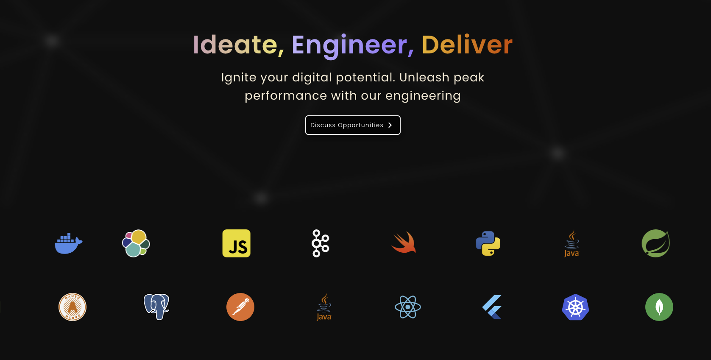

<h1 align="center">Bloggios - Open Source</h1>

<h2 align="center">Introducing Bloggios</h2>

<h2>What is Bloggios</h2>
Bloggios is an open-source web application designed to accelerate the learning process for Next.js on the client-side and Spring Boot Microservice on the server-side through a hands-on practice model. Developed by Rohit Parihar and Rakesh Shaw, Bloggios aims to redefine technical education by offering an immersive learning platform.

## Features

### Social Media Integration
- Seamlessly incorporate social media functionalities to foster collaboration among users.
- Enable sharing insights, connecting with peers, and engaging in discussions.

### User Interaction
- Allow users to follow other learners, participate in discussions through comments, and create their own content (blogs, Q&A sessions).
- Cultivate a vibrant community-driven learning ecosystem.

### Real-time Messaging
- Facilitate instant communication and collaboration among users.
- Enable swift exchange of ideas, feedback, and support.

### Instructor-led Sessions
- Provide a platform for instructors to host events or sessions.
- Users can participate, learn from industry experts, and gain insights into various technical domains.

### Comprehensive Learning Resources
- Curate diverse learning materials, including tutorials, documentation, and interactive exercises.
- Cater to learners of all proficiency levels and learning preferences.

## Getting Started

### Prerequisites
- [Node.js](https://nodejs.org/) installed on your machine.
- [Spring Boot](https://spring.io/projects/spring-boot) installed for server-side development.

### Installation
1. Clone the repository.
2. Install dependencies for both the client-side (Next.js) and server-side (Spring Boot).
3. Configure the application according to your environment.
4. Run the application.

## Contributing
We welcome contributions from the community! Please read our [Contribution Guidelines](CONTRIBUTING.md) before submitting pull requests.

## License
This project is licensed under the [MIT License](LICENSE).

## Acknowledgments
- Hat tip to anyone whose code was used.
- Inspiration from other open-source projects.
